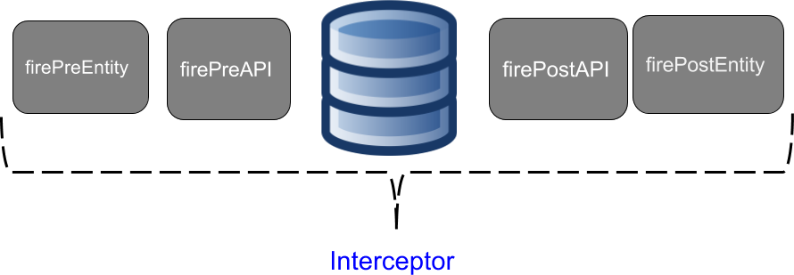

# The main idea behind the API

Once, we talked about the importance of the standard of a NoSQL database API; the next step is to discuss, in more details, about API. However, to make a natural explanation, first going to talk about both layer and tier. These structures level make the communication, maintenance, split the responsibility clearer. The new API proposal is going to be responsible for being a bridge between the logic tier and data tier, to do this, we need to create two APIs one to communication to a database and another one to be a high abstraction to Java application.

In software, the world is common that application has structures: tier, physical structure, and layer, logic one. The multi-tier application has three levels:

* **Presentation tier**: That has as primary duty translate the result, from below tiers, to the user a can understand.
* **Logic tier**: The tier where has all business rules, process, conditions, save the information, etc. This level moves and processes information between other levels.
* **Data tier**: Storage and retrieve information either database or a system file.

Talking more precisely about the physical layer, logic to separate responsibilities, there are layers

The logic tier, where the application and the business rule stay, it has layers:

* **Application layer:** The bridge between the view tier and logic tier, e.g., Convert an object into either JSON or HTML.
* **Service layer:** The service layer, this can be either Controller or a Resource.
* **Business Layer:** where the whole business and the model be.
* **Persistence Layer:** The platform between the logic tier and data tier. The layer has an integration such as DAO or repository.

Within a persistence layer, it has its layers: A Data Access Object, DAO, this structure connect business layer and persistence layer. Inside it has an API that does database. Currently, there is a difference between SQL and NoSQL database:

In the relational database there are two mechanisms, beyond DAO, JDBC, and JPA:

* **JDBC**: a deep layer with a database that has communications, basic transactions, basically it's a driver to a particular database.
* **JPA**: A high layer that has communication either JDBC and JPA. This layer has high mapping to Java; this place has annotations and an EntityManager. In general, a JPA has integration with other specifications such as CDI and Bean Validation.

A huge advantage of this strategy that one change, either JDBC or JPA, can happen quickly. When a developer changes a database, he just needs the switch to a respective driver by a database and done! Code ready to a new database changed.

In a NoSQL database, there isn't a strategy to save code or little impact for a change. All APIs are different and don't follow any one standard, so one change to new database results in a lot of work. There are some solutions such as Spring Data, Hibernate OGM, TopLink NoSQL but it's at a high level. In other words, if this high-level API hasn't support to a particular database the result going to be either changing a high-level API or use the API from NoSQL database directly, so lost a lot of code. This solution has several issues:

* The database vendor need to be worried about the high-level mapping to Java world
* The solution provider needs to be concerned about the low level of communication with a particular database. \* The database vendor needs to “copy” this communication solutions to all Java vendors.
* To a Java developer there are two lock-in types: If a developer uses an API directly for a change, it will lose code. If a developer uses a high-level mapping, this developer has lock-in in a Java solution because if this high level hasn't support to a particular NoSQL database, the developer needs to change to either Java solution or use an API NoSQL directly.

The solve this problem the API should have two layers:

* The communication layer: the driver from a particular database that connects Java to an accurate database. This layer has four specializations, one to each NoSQL type.
* The mapping level: its duty is to high concept to Java developers, this layer has annotations and integration to other specializations.

These APIs are optional each other, in other words, a Java solution just needs to implement a great solution, and the database vendors need to implements the connection API.

## JNoSQL

The JNoSQL is a several tool to make easy integration between the Java Application with the NoSQL. JNoSQL has a standard API. However, NoSQL has a diversity even when both are the same type. Eg. two column family databases, HBase and Cassandra, they have particular behavior and resource that make their individual such as Cassandra Query Language and consistency level that just does exist on Cassandra. So the API must be extensive and configurable to have support also to a specific database. To solve this problem the project gonna have two layers:

* **Communication API**: An API just to communicate with the database, exactly what JDBC does to SQL. This API is going to have four specializations, one for each kind of database.
* **Mapping API**: An API to do integration and do the best integration with the Java developer. That is going to be annotation drive and going to have integration with other technologies like Bean Validation, etc.

### Diana

The Diana Project has a goal do the low-level API, in other words, communicate with the NoSQL databases. This project is going to work as a driver to NOSQL databases. At overall it has four APIs inside, one for each NoSQL kind, beyond it own TCK. A test compatibility kit, the TCK, are a test group that makes sure if an A NoSQL database does support a database, e.g., If A key value database wants to prove its database has Diana support.

So even Diana does not do the mappinng level, supports to make the developer life easier, it makes easier integration with frameworks that do this.

Diana is valuable also alone when a developer what to use just the communication layer, that is going to easier to change to another database of the same type.

### Artemis

Artemis is the integration and mapping layer, in other words, it takes the communication level, Diana, and it does integration with others technologies such as Bean Validation and also with an entity model. It has a CDI engine; its formula is simple:

Diana plus CDI equals to Artemis.

As Diana have, Artemis also has an API to each database flavor. Using CDI as the engine, each component is configurable, and it has features such as:

* Persist an object through annotation
* Make replaceable any component \(reflections, entity conversions, cache, persistence lifecycle and more\).
* Observer event a continued existence database lifecycle \(each databases kind has an individual event\).

An important point about CDI events is how easy is create and add new functionalities without change the core code. That is easy to use bean validation just listen to an event.

