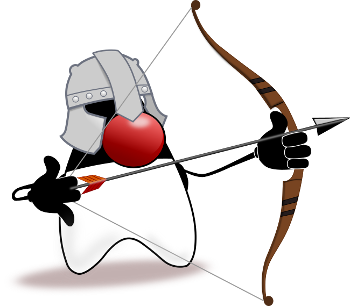

## Artemis introduction

The Artemis project is the abstraction level, to put it differently, it has the same goals of the either JPA or ORM to NoSQL world, which converts the entity object to Diana model.

This level is in charge to do integration among technologies such as Bean Validation. The  Artemis has annotations that make the Java developer life easier. As Diana project, it must be extensible and configurable to keep the diversity on NoSQL database.

To go straight and cover the four NoSQL types, this API has four domains:

* `org.jnosql.artemis.column`

* `org.jnosql.artemis.document`

* `org.jnosql.artemis.graph`

* `org.jnosql.artemis.key`

#### The Artemis project

Artemis has three parts:

* **Artemis-core**: That is the Artemis engine where there are the events, annotations and the Diana integration.

* **Artemis-validation**: That is the Bean Validation integration as artemis-core plugin.

* **Artemis-driver**: Like Diana, there is a support for database diversity. This project has extensions to the each database type on the database abstraction level.
