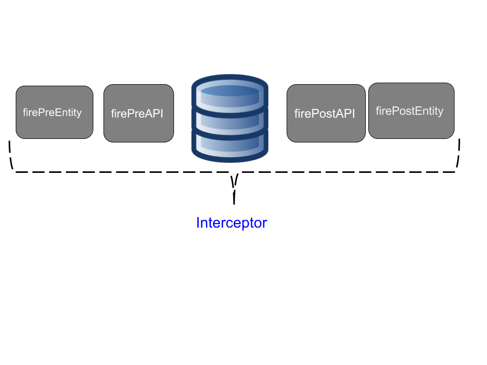

### Classes repositórios

The repositories class has a goal to persist an Entity Model through Diana API. It has three components:

* **Converter**: That converts the Entity to a communication level API.

* **EntityManager**: The EntityManager from Diana.

* **Workflow**: That defines the workflow when either save or update an entity. As show the picture bellow. These events are useful when you, eg., want to validate data before be saved.

The default workflow has four events:

1. **firePreEntity**: The Object received from Artemis.
2. **firePreAPI**: The object converted to a communication layer.
3. **firePostAPI**: The entity connection as a response from the database.
4. **firePostEntity**: The entity model from the API low level from the `firePostAPI`.
